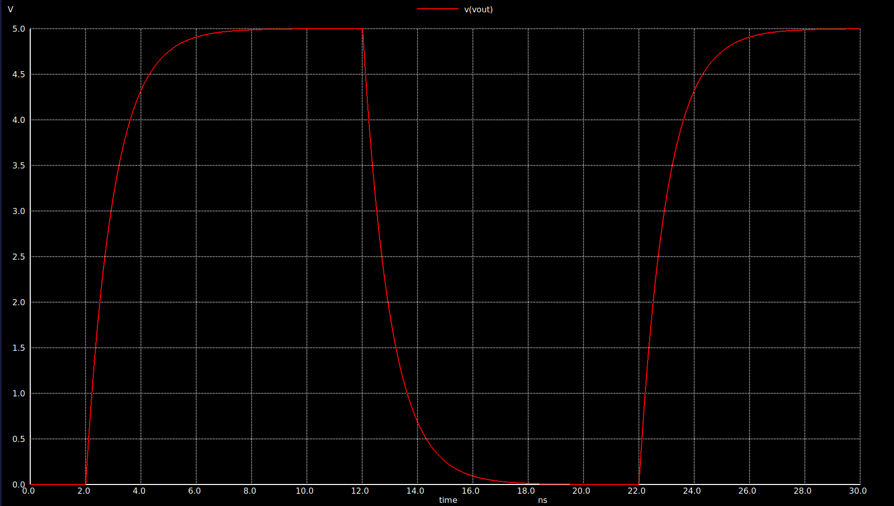
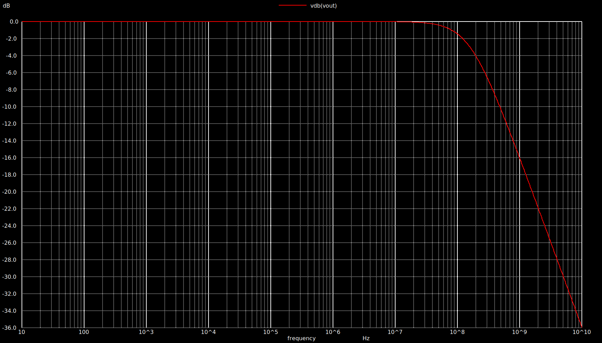

# Lab Notebook

Maintain Lab notebook here.

# Lab 1: Linux, Vim and Git

## 1.BASIC LINUX COMMAND
Commands used are:
- 'echo'
- 'pwd'
- 'cd'
- 'ls'
  and others
   


## 2. FILE AND DIRECTORY HANDLING COMMANDS
Commands used are:
- 'mkdir'
- 'touch'
- 'rm'
- 'rmdir'
  and others
  


# Lab 2: NGSPICE

## 1.VOLTAGE DIVIDER

Voltage Divider Netlist/Circuit Was Simulated Successfully 

```spice
* This is netlist/circuit of a simple voltage divider
  
R1 vin vout 1K
R2 vout 0 1K

*Pulse StimulusVpulse vin 0 PULSE(0 5 0.5u 10n 10n 0.5u 1u)

*Transient Analysis
.TRAN 0.1u 1.5u

.control
RUN
PLOT V(vout)
.endc

.end
```
### Observation


## 2.ID vs VGS

The variation of drain current with gate-source voltage was analyzed.

```spice
Title: Id-vs-Vgs for NMOS in Saturation region

* Level-1 Model
.MODEL nmos1 NMOS (LEVEL=1 PHI=0.846 VTO=0.514 KP=122U GAMMA=0.55 LAMBDA=0.0)

* Set the device temperature
.TEMP 27

* Netlist
M2 D2 D2 0 B nmos1 W=5u L=1u
Vds D 0 DC 5
Vid2 D D2 DC 0
Vsb 0 B DC 0

* DC Sweep Analysis
.DC Vds 0 5 0.001 Vsb 0 1 0.5

.CONTROL
RUN
PLOT Vid2#branch vs V(D)
PLOT (2*Vid2#branch)^0.5 vs V(D)
.ENDC

.END
```
### Observation


# Lab 3: NGSPICE

## 1.RC CIRCUIT WITH STEP INPUT

The RC step response circuit was simulated successfully.

```spice
Title: RC Step response

* RC Circuit
R1 vin vout 1e3
C1 vout 0 1p

* Pulse Stimulus
Vpulse vin 0 PULSE(0 5 2n 10p 10p 10n 20n)

.MEASURE TRAN tr1090 TRIG v(vout) VAL=0.5 RISE=1 TARG v(vout) VAL=4.5 RISE=1

* Transient Analysis
.TRAN 1p 30n

.control
RUN
PLOT v(vout)
.endc

.end
```


## 2.RC CIRCUIT FREQUENCY RESPONSE

```spice
* This is a pulse stimulus with lowvoltage(v1=0V) high(v2=5V)
Vpulse vin 0 AC=1 PULSE 0 5 2n 10p 10p 10n 20n

.MEASURE TRAN tr1090 TRIG v(vout) VAL=0.5 RISE=1 TARG v(vout) VAL=4.5 RISE=1

* Transient analysis
*.TRAN step-size total-sim-time
*.TRAN 1p 30n

*.AC DEC 100 10 10e9
*.MEAS AC vdbmax MAX vdb(vout)
*.MEAS AC f3db WHEN vdb(vout)=v3db fall=last

* Control script
.control
save all
AC DEC 100 10 10e9
MEAS AC vdbmax MAX vdb(vout)
LET v3db = vdbmax - 3.0
MEAS AC f3db WHEN vdb(vout)=v3db fall=last
write rc-step.raw

plot vdb(vout)

.endc

.end
```


# Lab 4: RC CIRCUIT IN NGSPICE 

## 1.RC CIRCUIT AS LOW PASS FILTER

### a. The RC circuit was simulated to measure the rise time and fall time of the output waveform.

```spice
*RC CIRCUIT
R1 Vin Vout 1k
C1 Vout 0 1p

*Pulse Input
Vpulse Vin 0 PULSE(0 5 0 10p 10p 10n 20n)

*Measure Rise Time (10% to 90%)
.measure tran trise
+TRIG V(Vout) VAL=0.5 RISE=1
+TARG V(Vout) VAL=4.5 RISE=1

*Measure Fall Time (90% to 10%)
.measure tran tfall
+TRIG V(Vout) VAL=4.5 FALL=1
+TARG V(Vout) VAL=0.5 FALL=1

.TRAN 1p 50n

.control
run
plot V(Vin) V(Vout)
.endc

.end
```

#### Observation

The rise time and fall time of the RC circuit were measured successfully.


### b.The RC circuit was simulated to determine the effective time constant.

RC Circuit with C = 50pF

```spice
* RC CKT WITH C=50p

R1 vin vout 1k
C1 vout 0 50p

Vpulse vin 0 PULSE(0 5 0 10p 10p 10n 20n)

* Effective time constant
.measure tran tau
+TRIG v(vout) VAL=3.15 RISE=1
+TARG v(vout) VAL=1.85 FALL=1

.TRAN 1p 300n

.control
run
plot v(vin) v(vout)
.endc

.end
```

#### Observation

The effective time constant of the RC circuit was measured successfully.


### c.RC Average Output

The average output voltage of the RC circuit was measured.

```spice
* RC average output

R1 vin vout 1k
C1 vout 0 50p

Vpulse vin 0 PULSE(0 5 0 10p 10p 10n 20n)

* Average output voltage
.measure tran avgout AVG v(vout) FROM=40n TO=80n

.tran 1p 300n

.control
run
plot v(vout)
.endc

.end
```

#### Observation

The average output voltage of the RC circuit was obtained successfully.


