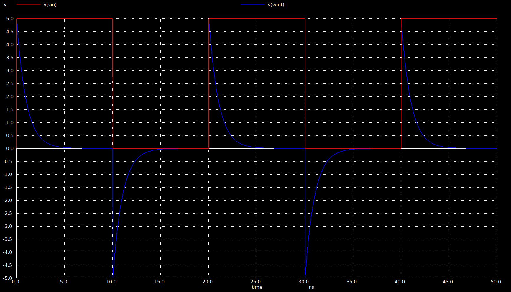
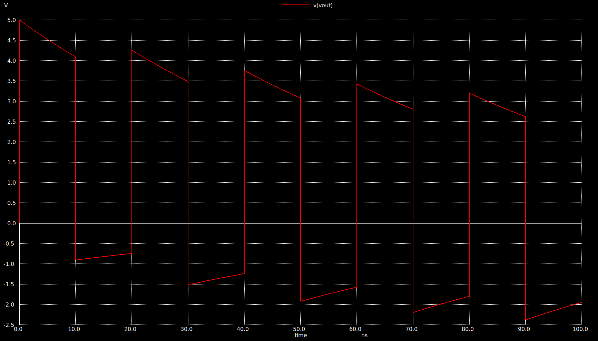
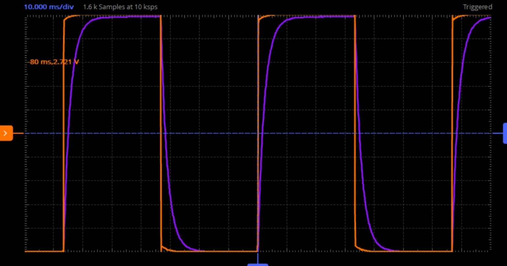

# Lab Notebook

Maintain Lab notebook here.

# Lab 1: Linux, Vim and Git

## 1.BASIC LINUX COMMAND
Commands used are:
- 'echo'
- 'pwd'
- 'cd'
- 'ls'
  and others
   


## 2. FILE AND DIRECTORY HANDLING COMMANDS
Commands used are:
- 'mkdir'
- 'touch'
- 'rm'
- 'rmdir'
  and others
  


# Lab 2: NGSPICE

## 1.VOLTAGE DIVIDER

Voltage Divider Netlist/Circuit Was Simulated Successfully 

```spice
* This is netlist/circuit of a simple voltage divider
  
R1 vin vout 1K
R2 vout 0 1K

*Pulse StimulusVpulse vin 0 PULSE(0 5 0.5u 10n 10n 0.5u 1u)

*Transient Analysis
.TRAN 0.1u 1.5u

.control
RUN
PLOT V(vout)
.endc

.end
```
### Observation


## 2.ID vs VGS

The variation of drain current with gate-source voltage was analyzed.

```spice
Title: Id-vs-Vgs for NMOS in Saturation region

* Level-1 Model
.MODEL nmos1 NMOS (LEVEL=1 PHI=0.846 VTO=0.514 KP=122U GAMMA=0.55 LAMBDA=0.0)

* Set the device temperature
.TEMP 27

* Netlist
M2 D2 D2 0 B nmos1 W=5u L=1u
Vds D 0 DC 5
Vid2 D D2 DC 0
Vsb 0 B DC 0

* DC Sweep Analysis
.DC Vds 0 5 0.001 Vsb 0 1 0.5

.CONTROL
RUN
PLOT Vid2#branch vs V(D)
PLOT (2*Vid2#branch)^0.5 vs V(D)
.ENDC

.END
```
### Observation


# Lab 3: NGSPICE

## 1.RC CIRCUIT WITH STEP INPUT

The RC step response circuit was simulated successfully.

```spice
Title: RC Step response

* RC Circuit
R1 vin vout 1e3
C1 vout 0 1p

* Pulse Stimulus
Vpulse vin 0 PULSE(0 5 2n 10p 10p 10n 20n)

.MEASURE TRAN tr1090 TRIG v(vout) VAL=0.5 RISE=1 TARG v(vout) VAL=4.5 RISE=1

* Transient Analysis
.TRAN 1p 30n

.control
RUN
PLOT v(vout)
.endc

.end
```
### Observation


## 2.RC CIRCUIT FREQUENCY RESPONSE

```spice
* This is a pulse stimulus with lowvoltage(v1=0V) high(v2=5V)
Vpulse vin 0 AC=1 PULSE 0 5 2n 10p 10p 10n 20n

.MEASURE TRAN tr1090 TRIG v(vout) VAL=0.5 RISE=1 TARG v(vout) VAL=4.5 RISE=1

* Transient analysis
*.TRAN step-size total-sim-time
*.TRAN 1p 30n

*.AC DEC 100 10 10e9
*.MEAS AC vdbmax MAX vdb(vout)
*.MEAS AC f3db WHEN vdb(vout)=v3db fall=last

* Control script
.control
save all
AC DEC 100 10 10e9
MEAS AC vdbmax MAX vdb(vout)
LET v3db = vdbmax - 3.0
MEAS AC f3db WHEN vdb(vout)=v3db fall=last
write rc-step.raw

plot vdb(vout)

.endc

.end
```
### Observation


# Lab 4: RC CIRCUIT IN NGSPICE 

## 1.RC CIRCUIT AS LOW PASS FILTER

### a. The RC circuit was simulated to measure the rise time and fall time of the output waveform.

```spice
*RC CIRCUIT
R1 Vin Vout 1k
C1 Vout 0 1p

*Pulse Input
Vpulse Vin 0 PULSE(0 5 0 10p 10p 10n 20n)

*Measure Rise Time (10% to 90%)
.measure tran trise
+TRIG V(Vout) VAL=0.5 RISE=1
+TARG V(Vout) VAL=4.5 RISE=1

*Measure Fall Time (90% to 10%)
.measure tran tfall
+TRIG V(Vout) VAL=4.5 FALL=1
+TARG V(Vout) VAL=0.5 FALL=1

.TRAN 1p 50n

.control
run
plot V(Vin) V(Vout)
.endc

.end
```

#### Observation

The rise time and fall time of the RC circuit were measured successfully.


### b.The RC circuit was simulated to determine the effective time constant.

RC Circuit with C = 50pF

```spice
* RC CKT WITH C=50p

R1 vin vout 1k
C1 vout 0 50p

Vpulse vin 0 PULSE(0 5 0 10p 10p 10n 20n)

* Effective time constant
.measure tran tau
+TRIG v(vout) VAL=3.15 RISE=1
+TARG v(vout) VAL=1.85 FALL=1

.TRAN 1p 300n

.control
run
plot v(vin) v(vout)
.endc

.end
```

#### Observation

The effective time constant of the RC circuit was measured successfully.


### c.RC Average Output

The average output voltage of the RC circuit was measured.

```spice
* RC average output

R1 vin vout 1k
C1 vout 0 50p

Vpulse vin 0 PULSE(0 5 0 10p 10p 10n 20n)

* Average output voltage
.measure tran avgout AVG v(vout) FROM=40n TO=80n

.tran 1p 300n

.control
run
plot v(vout)
.endc

.end
```

#### Observation

The average output voltage of the RC circuit was obtained successfully.


## 2.RC CIRCUIT AS HIGH PASS FILTER

### a.The RC high-pass filter was simulated to measure the rise time and fall time of the output waveform.

```spice
* RC high pass filter

C1 Vin Vout 1p
R1 Vout 0 1k

Vpulse Vin 0 PULSE(0 5 0 10p 10p 10n 20n)

* Rise time
.measure tran trise
+TRIG V(Vout) VAL=0.5 RISE=1
+TARG V(Vout) VAL=4.5 RISE=1

* Fall time
.measure tran tfall
+TRIG V(Vout) VAL=4.5 FALL=1
+TARG V(Vout) VAL=0.5 FALL=1

.tran 1p 50n

.control
run
plot V(Vin) V(Vout)
.endc

.end
```

#### Observation

The rise time and fall time of the RC high-pass filter were measured successfully.



## b.The CR circuit was simulated to determine the effective time constant.

RC Circuit with C = 50pF

```spice
* CR ckt with c=50p

C1 Vin Vout 50p
R1 Vout 0 1k

Vpulse Vin 0 PULSE(0 5 0 10p 10p 10n 20n)

* Effective Time Constant
.measure tran tau
+TRIG V(Vout) VAL=3.15 FALL=1
+TARG V(Vout) VAL=1.85 FALL=1

.tran 1p 300n

.control
run
plot V(Vin) V(Vout)
.endc

.end
```

#### Observation

The effective time constant of the CR circuit was measured successfully.


### c.CR Circuit Average Output Voltage

The average output voltage of the CR circuit was measured.

```spice
* CR ckt average output voltage

C1 Vin Vout 50p
R1 Vout 0 1k

Vpulse Vin 0 PULSE(0 5 0 10P 10P 10N 20N)

* Average output voltage
.measure tran avgout AVG V(Vout) FROM=60n TO=100n

.tran 1p 100n

.control
run
plot V(vout)
.endc

.end
```

#### Observation

The average output voltage of the CR circuit was obtained successfully.



# Lab 7: ADALM LAB

## Experiment 1: Voltage Divider using ADALM2000 and Scopy

A voltage divider circuit was implemented using two resistors and tested using the ADALM2000 platform. The input and output voltages were measured using the Scopy Voltmeter tool. The measured output voltage was approximately half of the input voltage, demonstrating the voltage divider principle.

### Observation

The measured output voltage matched the expected voltage divider calculation.


### Result

The voltage divider circuit was successfully implemented and verified using ADALM2000 and Scopy.

## Experiment 2:Frequency Generator and Oscilloscope Verification

A sine wave was generated using the Scopy Signal Generator and observed using the Oscilloscope.

The waveform was displayed correctly on the screen, confirming the proper operation of both instruments. This experiment demonstrated basic signal generation, waveform observation, and verification using the ADALM2000 platform.

### Observation

A stable sinusoidal waveform was observed on the oscilloscope display.


### Result  

The generated signal was successfully measured and displayed, verifying the correct functioning of the Signal Generator and Oscilloscope.

# Lab 8: ADALM LAB 

## RC Circuit Response for Different Time Constants

The RC circuit was implemented using ADALM2000 and Scopy. The output waveform was observed by varying the time constant (τ = RC) relative to the input signal period.

### Observation

- τ > T : Slow exponential charging and discharging of the capacitor.
- τ ≈ T : Partial charging and discharging observed.
- τ < T : Output approaches a triangular waveform.

### Result

The waveform shape depends on the RC time constant. Increasing τ slows the circuit response, while decreasing τ causes the circuit to respond more quickly to the input signal.




# Lab 10: MOS Parameter Extraction Using Ngspice

## a.Parameter Extraction of Level-1 Model

```spice
Title: Id-vs-Vgs for and NMOS in Saturation region
* Comparing the Level-1 and Level-49 SPICE model
* From sqrt(1*Id) vs Vgs, Vt, Kp and gamma can be extracted

* Level-1 Model 
.MODEL nmos1 NMOS (LEVEL=1 PHI=0.846 VT0=0.514 KP=122U GAMMA=0.55 LAMBDA=0.0)

* Set the device temperature
.TEMP 27

* Netlist:
* diode connected (Drain/Gate shorted nmos 
M2	D2	D2	0	B 	nmos1    W=5u L=1u
Vds	D	0	DC	5
Vid2	D	D2	DC	0
Vsb	0	B	DC	0

* DC Sweep Analyses
*.DC 	Vsrc	start	stop	step	Vsrc2	start stop step
*.DC	Vds	0	5	0.001  Vsb  0 1 0.5
.DC	Vds	0	5	0.001  

* ngspice Script with control statements.
.CONTROL
RUN
** Plot sqrt(2*Id) for M1 amd M2
**PLOT Vid2#branch vs V(D)
PLOT (2*Vid2#branch)^0.5  vs V(D) 
** Calculating uCox from rt-Id-Vgs slope
LET rt_id=Vid2#branch^0.5 
LET d_rt_id=deriv(rt_id)
MEAS DC d_at_1v FIND d_rt_id AT=2.0
LET ucox=(2.0/5.0)*d_at_1v^2.0
print ucox
** Calculating Vt by calculating the intercept
MEAS DC rt_id_at_1  FIND rt_id AT=2.0
LET Vt=2.0-(d_at_1v^-1 * rt_id_at_1)
print Vt
.ENDC

.END
```
### Observation

## b.Parameter Extraction for Level-49 BSIM Model

## c.Level-1 vs Level-49 Comparison

```spice
### Id-vs-Vgs for NMOS in Saturation Region

```spice
Title: Id-vs-Vgs for and NMOS in Saturation region

* From sqrt(1*Id) vs Vgs, Vt, Kp and gamma can be extracted

* Level-49 BSIM 3v1 Model Library for 0.5um SCMOS Technology
.LIB scn4m_cnrs_bsim3v1.lib nom

* Level-1 Model
.MODEL sitn NMOS (LEVEL=1 PHI=0.846 VTO=0.514 KP=122U GAMMA=0.55 LAMBDA=0.0)

* Set the device temperature
.TEMP 27

* Netlist:
* Two diode connected (Drain/Gate shorted) nmos
* one with Level-1 model (M2) and another
* with Level-49 BSIM 3v1 model (M1)

M1 D1 D1 0 B scmosn W=5u L=1u
M2 D2 D2 0 B sitn   W=5u L=1u

Vds  D  0  DC 5
Vid1 D  D1 DC 0
Vid2 D  D2 DC 0
Vsb  0  B  DC 0

* DC Sweep Analyses
*.DC Vsrc start stop step Vsrc2 start stop step
.DC Vds 0 5 0.001 Vsb 0 1 0.5

* ngspice Script with control statements
.CONTROL
RUN

** Plot sqrt(2*Id) for M1 and M2
PLOT (2*Vid2#branch)^0.5 (2*Vid1#branch)^0.5 vs V(D)

LET rt_id = Vid2#branch^0.5
LET d_rt_id = deriv(rt_id)

MEAS DC d_at_1v FIND d_rt_id AT=2.0
LET ucox=(2.0/5.0)*d_at_1v^2.0
print ucox

** Calculating Vt by calculating the intercept
MEAS DC rt_id_at_1 FIND rt_id AT=2.0
LET Vt=2.0-(d_at_1v^-1 * rt_id_at_1)
print Vt

*PLOT deriv(2*Vid2#branch) deriv(2*Vid1#branch) vs V(D)

.ENDC

.END
```
### Observation 
